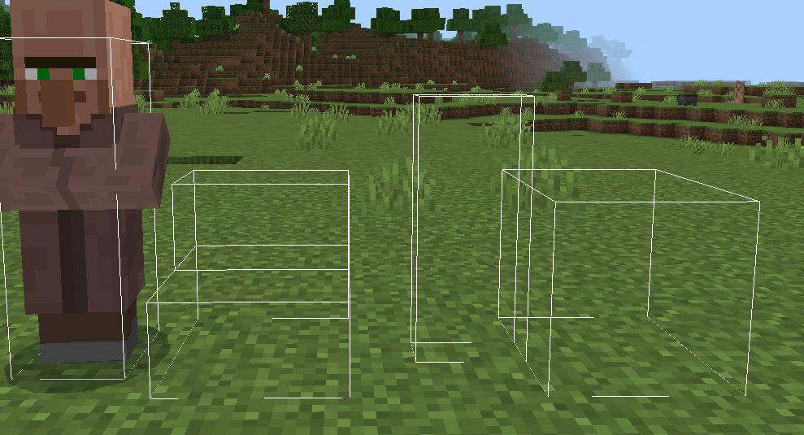

# CollisionBoxesDrawer
This is a [PocketMine-MP](https://github.com/pmmp/PocketMine-MP) plugin that helps you debugging block/entity collision boxes by rendering their server-side versions to the client.

## Commands
* `/boxdrawerstick`: Gives player a stick to render collision boxes
* `/mycollisionboxes`: Renders executor's collision boxes

## Usage
* To draw block or entity collision boxes, right click on it with a drawer stick obtained via `/boxdrawerstick` command.
* To hide collision boxes, right click on that block or entity again.
* To draw your collision boxes, type `/mycollisionboxes` command.
* To hide your collision boxes, type `/mycollisionboxes` again.

